# خطة تنفيذ الحذف المنطقي للتطبيقات

## الحالة

مقترحة — بانتظار الموافقة على التنفيذ.

## التاريخ

2026-07-23

## الهدف

استبدال الحذف المادي الحالي للتطبيقات بحذف منطقي يحافظ على السلامة المرجعية والسجل التاريخي، ويمنع استمرار استخدام بيانات اعتماد تطبيق محذوف، من دون اتخاذ أي قرار اعتماداً على اسم التطبيق أو كوده أو مصدر إنشائه.

## السياق

عملية إبطال مفتاح API تعطل المفتاح عبر تعيين `RevokedAt`، لكنها لا تحذف صفه. بعد الإبطال، يتجاوز فحص الحذف المفتاح لأنه لم يعد نشطاً، ثم يحاول المستودع حذف التطبيق مادياً. يمنع القيد `FK_ApiKeys_Applications` ذلك لأن صف المفتاح ما زال يشير إلى التطبيق، فتُرجع قاعدة البيانات الخطأ `SQL 547` وتتحول الاستجابة إلى `HTTP 500`.

لا توجد تطبيقات نظام محمية ضمن نموذج المجال. تطبيقات Seed تطبيقات عادية، ويجب تحديد أي سجل وإدارته بواسطة `Id` فقط. كما يجب إبقاء `Code` محجوزاً بعد الحذف وعدم إتاحته لتطبيق جديد.

## القرار

1. إضافة Soft Delete إلى `Applications` بواسطة `IsDeleted`, `DeletedAt`, و`DeletedBy`.
2. جعل حذف التطبيق يعين `IsDeleted = true` و`IsActive = false` بدلاً من إزالة الصف.
3. استبعاد التطبيقات المحذوفة من الاستعلامات التشغيلية افتراضياً.
4. إبقاء قيد تفرّد `Code` شاملاً للسجلات المحذوفة، ومنع إعادة استخدام الكود.
5. إزالة مفهوم تطبيق النظام من منطق التطبيقات بالكامل.
6. منع API Keys وWebhook Keys وRefresh Tokens من العمل عندما يكون التطبيق الأب محذوفاً أو غير نشط.
7. إبقاء مسار الاستعادة خارج نطاق هذه الدفعة؛ يمكن إضافته لاحقاً ليستعيد السجل نفسه بنفس `Id` و`Code`.

## المبدأ الحاكم

يحدد `Id` هوية السجل، وتحدد حالة دورة الحياة والتبعيات إمكانية استخدامه أو حذفه. لا يُستنتج سلوك أمني أو تشغيلي من الاسم أو الكود.

## خريطة التغيير

```mermaid
flowchart LR
    A["DELETE /Applications/{id}"] --> B["DeleteApplicationCommand"]
    B --> C["تحميل التطبيق بواسطة Id"]
    C --> D["فحص التبعيات النشطة"]
    D --> E["Application.Delete(deletedBy)"]
    E --> F["IsDeleted = 1 و IsActive = 0"]
    F --> G["ApplicationRepository.UpdateAsync"]
    G --> H["الاستعلامات تستبعد المحذوف"]
    H --> I["بيانات الاعتماد لا تُقبل"]
```

## نطاق الملفات

النطاق الموصى به هو **19 ملفاً: 18 ملفاً موجوداً وملف اختبار جديد**.

### 1. قاعدة البيانات — ملف واحد

#### `Auth/Auth_DB/dbo/Tables/Core/Applications.sql`

- إضافة `IsDeleted BIT NOT NULL DEFAULT 0`.
- إضافة `DeletedAt DATETIME2 NULL`.
- إضافة `DeletedBy UNIQUEIDENTIFIER NULL`.
- إضافة أو تعديل فهرس يخدم الاستعلامات الافتراضية ذات الشرط `IsDeleted = 0`.
- إبقاء `UQ_Applications_Code` شاملاً لكل الصفوف، بما فيها المحذوفة.

لا يلزم تعديل `Auth_DB.sqlproj` لأن ملف الجدول مشمول بالفعل في مشروع SSDT، وسيولد النشر فرق المخطط المطلوب.

### 2. طبقة Domain — 3 ملفات

#### `Auth/Auth.Domain/Entities/Application.cs`

- إضافة `IsDeleted`, `DeletedAt`, و`DeletedBy` بواجهات قراءة فقط.
- إضافة سلوك المجال `Delete(Guid deletedBy)`.
- جعل الحذف يعطل التطبيق ويضبط بيانات التدقيق.
- تحميل حالة الحذف من طبقة Persistence دون كشف public setters.

#### `Auth/Auth.Domain/Interfaces/Repositories/IApplicationRepository.cs`

- إزالة عقد الحذف المادي `DeleteAsync`.
- إضافة فحص Webhook Keys النشطة بواسطة `ApplicationId`.
- إبقاء جميع عمليات إدارة السجل معتمدة على `Id`.

#### `Auth/Auth.Domain/Errors/ApplicationErrors.cs`

- إزالة `CannotDeleteSystemApplication`.
- إزالة `CannotModifySystemApplication`.
- إضافة خطأ تعارض عند وجود Webhook Keys نشطة.
- إبقاء أخطاء API Keys وتعيينات المستخدمين والمنظمات.

### 3. طبقة Application — ملفان

#### `Auth/Auth.Application/Features/Applications/DeleteApplication/DeleteApplicationCommandHandler.cs`

- إزالة الشرط المبني على `application.Code == "AUTH"`.
- تحميل التطبيق بواسطة `Id` فقط.
- فحص API Keys وWebhook Keys وتعيينات المستخدمين والمنظمات النشطة.
- استدعاء `application.Delete(request.DeletedBy)`.
- الحفظ بواسطة `UpdateAsync` بدلاً من الحذف المادي.
- إبقاء النتيجة Domain Error عند وجود تبعية متوقعة، وعدم السماح بوصولها إلى `SqlException`.

#### `Auth/Auth.Application/Features/Authentication/RefreshToken/RefreshTokenCommandHandler.cs`

- رفض Refresh Token المرتبط بتطبيق محذوف أو غير نشط.
- منع تحويل غياب التطبيق إلى Audience افتراضي.
- عدم إصدار Access Token جديد إذا لم تعد هوية التطبيق صالحة.

### 4. طبقة Infrastructure — 3 ملفات

#### `Auth/Auth.Infrastructure/Persistence/ApplicationRepository.cs`

- قراءة وكتابة حقول الحذف.
- إضافة `IsDeleted = 0` إلى `GetByIdAsync`, `GetByCodeAsync`, `GetAllAsync`, `GetActiveAsync`, والاستعلامات ذات الصفحات.
- إبقاء `ExistsByCodeAsync` شاملاً للمحذوف حتى يظل الكود محجوزاً.
- إزالة `DELETE FROM Applications`.
- حفظ حالة الحذف بواسطة `UPDATE`.
- إضافة فحص Webhook Keys النشطة.

#### `Auth/Auth.Infrastructure/Persistence/ApiKeyRepository.cs`

- اشتراط أن يكون التطبيق الأب نشطاً وغير محذوف عند التحقق من API Key.
- إبقاء المفاتيح المبَطلة كسجلات تاريخية مرتبطة بالتطبيق.

#### `Auth/Auth.Infrastructure/Persistence/WebhookKeyRepository.cs`

- اشتراط أن يكون التطبيق الأب نشطاً وغير محذوف عند التحقق من Webhook Key.
- منع المفتاح من العمل حتى عند وجود بيانات غير متسقة أو سباق زمني أثناء الحذف.

### 5. الاختبارات — 3 ملفات

#### `Auth/Auth_API.Tests/ApplicationManagement/Commands/ApplicationCommandHandlerTests.cs`

- إزالة اختبار تطبيق النظام.
- إثبات إمكانية حذف تطبيق بأي اسم أو كود.
- التحقق من استدعاء Soft Delete وعدم استدعاء حذف مادي.
- اختبار التعارض عند وجود API Keys أو Webhook Keys أو تعيينات نشطة.

#### `Auth/Auth_API.Tests/Authentication/Commands/RefreshTokenCommandHandlerTests.cs`

- اختبار رفض Refresh Token لتطبيق محذوف.
- اختبار رفض Refresh Token لتطبيق غير نشط.
- التحقق من عدم إصدار توكن بـAudience افتراضي.

#### ملف جديد: `Auth/Auth_API.Tests/Domain/Entities/ApplicationTests.cs`

- اختبار الحالة الابتدائية غير المحذوفة.
- اختبار `Delete` وتعيين `IsDeleted`, `DeletedAt`, `DeletedBy`, و`IsActive`.
- اختبار ثبات هوية التطبيق وكوده بعد الحذف.

### 6. الترجمة — 7 ملفات

- `Auth/Auth_Localization/Resources/Errors/DomainErrors.resx`
- `Auth/Auth_Localization/Resources/Errors/DomainErrors.ar.resx`
- `Auth/Auth_Localization/Resources/Errors/DomainErrors.fa.resx`
- `Auth/Auth_Localization/Resources/Errors/DomainErrors.fr.resx`
- `Auth/Auth_Localization/Resources/Errors/DomainErrors.tr.resx`
- `Auth/Auth_Localization/Resources/Errors/DomainErrors.ur.resx`
- `Auth/Auth_Localization/Resources/Errors/DomainErrors.zh.resx`

التعديلات:

- إزالة رسائل تطبيق النظام غير المستخدمة.
- إضافة رسالة منع الحذف بسبب Webhook Keys النشطة.

## ملفات خارج النطاق

- واجهة Console: عملية `DELETE` الحالية ستبقى، وستختفي الصفوف بعد إعادة تحميل القائمة لأن الاستعلامات تستبعد المحذوف.
- `ApplicationsController`: لا يتغير عقد نقطة النهاية.
- DTOs وOpenAPI schema: لا تُكشف حقول الحذف في الاستجابات العامة.
- Seed files: تظل التطبيقات المزروعة تطبيقات عادية.
- `Auth_DB.sqlproj`: ملف الجدول موجود مسبقاً في المشروع.
- ترحيل OAuth `client_id` من `Code` إلى `Id`: قرار مستقل وأكبر من إصلاح الحذف الحالي.
- Restore endpoint وHard Purge: مؤجلان إلى دفعات مستقلة.

## سياسة Code

- لا يعاد استخدام `Code` بعد Soft Delete.
- يبقى قيد `UQ_Applications_Code` غير مفلتر.
- لا يُنشأ Unique Filtered Index على `IsDeleted = 0`.
- الاستعادة المستقبلية تعيد السجل نفسه بنفس `Id` و`Code`.
- التطبيق الجديد يحصل على كود جديد.

## ترتيب التنفيذ

1. تعديل مخطط قاعدة البيانات.
2. إضافة حالة الحذف وسلوكها إلى Aggregate `Application`.
3. تعديل عقد المستودع وتنفيذه.
4. تعديل Delete handler وإزالة قواعد تطبيق النظام.
5. تحصين API Key وWebhook Key وRefresh Token validation.
6. تحديث رسائل المجال والترجمات.
7. تحديث الاختبارات وإضافة اختبارات الكيان.
8. بناء قاعدة البيانات والحل وتشغيل الاختبارات.

## المخاطر ومعالجتها

| الخطر | التأثير | المعالجة |
|---|---|---|
| تطبيق محذوف يبقى قابلاً للمصادقة | عالٍ | تعطيل التطبيق وفحص حالته في كل مسارات بيانات الاعتماد |
| Refresh Token يتحول إلى Audience افتراضي | عالٍ | إرجاع خطأ عند غياب التطبيق المرتبط أو تعطيله |
| إعادة استخدام Code تربط مراجع قديمة بتطبيق جديد | عالٍ | إبقاء قيد التفرّد شاملاً للمحذوف |
| استعلام ينسى شرط IsDeleted | متوسط/عالٍ | مركزة الفلاتر في `ApplicationRepository` واختبار مسارات القراءة |
| نشر المخطط على بيانات موجودة | متوسط | Default يضبط `IsDeleted = 0`، والحقول الأخرى Nullable |
| سباق بين إنشاء مفتاح وحذف التطبيق | متوسط | فحص حالة التطبيق داخل استعلام التحقق من المفتاح كدفاع إضافي |

## معايير القبول

- [ ] يمكن حذف أي تطبيق بصرف النظر عن اسمه أو كوده أو مصدر إنشائه.
- [ ] تحدد عملية الحذف التطبيق بواسطة `Id` فقط.
- [ ] لا ينفذ المسار أي `DELETE FROM Applications`.
- [ ] يضبط الحذف `IsDeleted = 1`, `IsActive = 0`, `DeletedAt`, و`DeletedBy`.
- [ ] لا يظهر التطبيق المحذوف في القوائم أو الاستعلام بواسطة `Id` أو `Code`.
- [ ] لا يمكن إنشاء تطبيق جديد بكود تطبيق محذوف.
- [ ] لا تعمل API Keys أو Webhook Keys التابعة لتطبيق محذوف.
- [ ] لا يمكن تدوير Refresh Token مرتبط بتطبيق محذوف أو غير نشط.
- [ ] لا يظهر `SQL 547` في مسار حذف التطبيق.
- [ ] تعاد أخطاء التبعية المتوقعة كـDomain Errors مناسبة، لا كـ`500`.
- [ ] تمر اختبارات الحل وقاعدة البيانات.
- [ ] لا تتغير عقود API العامة أو الواجهة.

## التحقق المقترح

1. بناء مشروع قاعدة البيانات `Auth_DB.sqlproj` بإعداد Release.
2. بناء `Auth.sln`.
3. تشغيل `Auth_API.Tests`.
4. التحقق من سيناريو تطبيق يحمل API Key مبطلاً: ينجح Soft Delete وتبقى الصفوف التاريخية.
5. التحقق من رفض بيانات اعتماد تطبيق محذوف.
6. التحقق من رفض إنشاء تطبيق جديد بالكود المحجوز.

## البدائل المرفوضة

### الحذف المادي بعد حذف مفاتيح API فقط

مرفوض لأنه يعالج أول مفتاح أجنبي فقط، بينما توجد تبعيات أخرى عديدة، وقد يؤدي إلى أخطاء متتالية أو فقد سجل تاريخي.

### `ON DELETE CASCADE` واسع

مرفوض لأنه قد يحذف بيانات أمنية وتاريخية دون سياسة احتفاظ واضحة.

### إعادة استخدام Code بواسطة Unique Filtered Index

مرفوض في الوضع الحالي لأن `Code` ما زال مستخدماً كمعرّف OAuth وAudience، وإعادة استخدامه قد تعيد ربط مراجع أو توكنات قديمة بتطبيق جديد.

### استخدام `IsActive` وحده للحذف

مرفوض لأن عدم النشاط حالة تشغيلية قابلة للعكس، بينما الحذف حالة مستقلة في دورة حياة السجل.

## تعريف الاكتمال

- [ ] تنفيذ جميع الملفات التسعة عشر المحددة.
- [ ] نجاح بناء قاعدة البيانات والحل.
- [ ] نجاح الاختبارات ذات الصلة وعدم حدوث Regression.
- [ ] مراجعة أمان مسارات API Key وWebhook Key وRefresh Token.
- [ ] مراجعة نهائية وفق قائمة المشروع الإلزامية قبل اعتبار التنفيذ مكتملاً.
